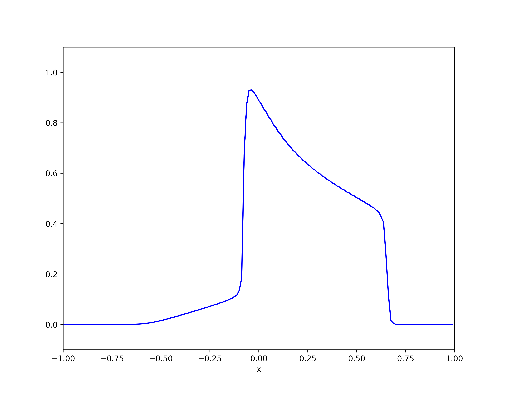
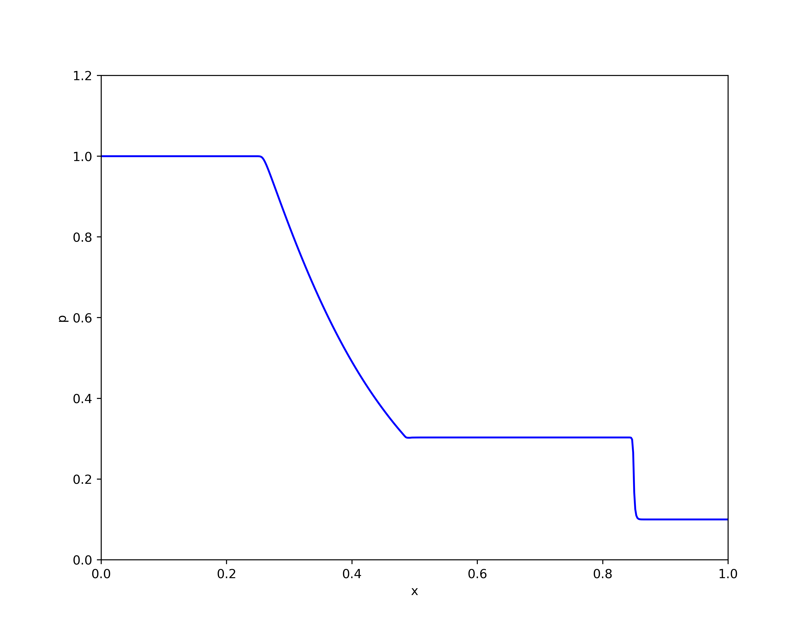
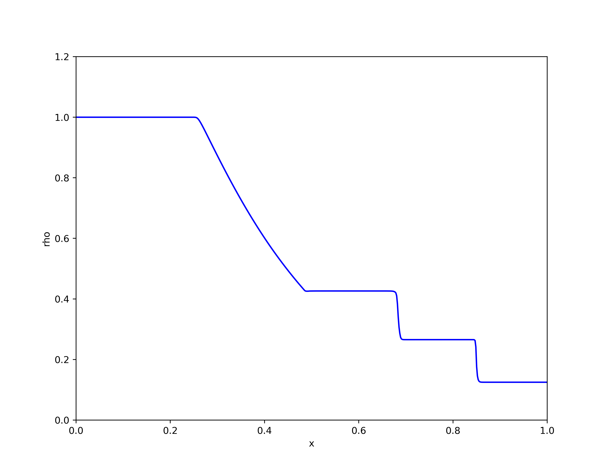
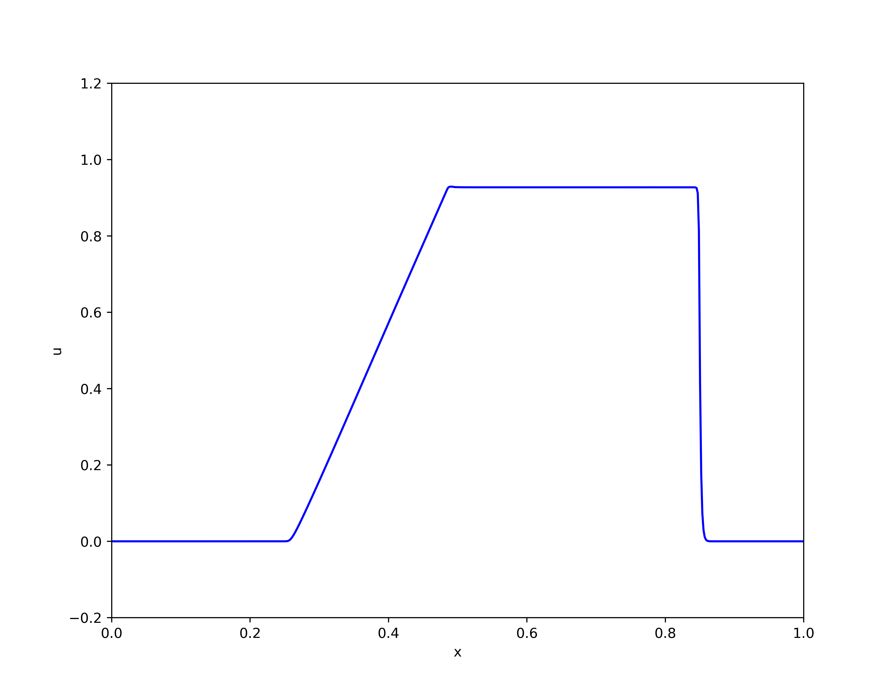
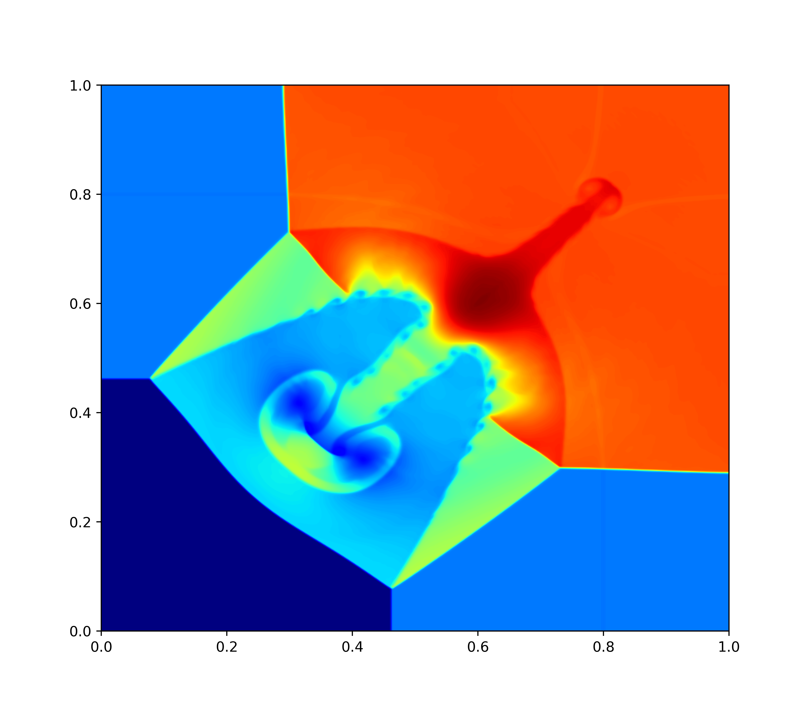

# DG_demo

This is a demo project for the Discontinous Galerkin method, a very fundamental modal DG algorithm is implemented for solving 1D scalar transport equation, 1D Euler equation and 2D Euler equation. The 2D Euler case requires the [xtensor](https://github.com/xtensor-stack/xtensor) to support multi-dimensional array. Results are shown by [matplotlib](https://github.com/lava/matplotlib-cpp).

# Compile and run

The program is based on CMAKE build system, to build the program, run the following commands under the root directory:

```
cmake -B build
cmake --build build
```

# Show cases

## Buckley non-convex flux problem

{:height="50%" width="50%"}

## Sod shock tube problem

{:height="50%" width="50%"}
{:height="50%" width="50%"}
{:height="50%" width="50%"}

## Two-dimensional Riemann problem

{:height="50%" width="50%"}